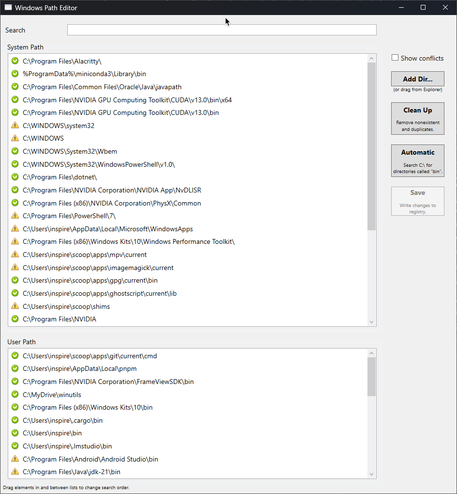

# windows path editor

a tool for managing your PATH environment variable on windows.



## why

on windows you constantly need to edit your PATH — every tool installs to its own `bin` directory — yet the built-in environment editor gives you a single-line textbox to work with. this app fixes that.

## features

- drag-and-drop reordering of path entries
- conflict detection between directories (wrong exe or dll being loaded)
- one-click removal of broken/bogus entries
- disk scan to find `bin` directories and add them automatically
- UAC-aware (elevates when writing to system PATH)

## requirements

- windows 10 or later
- self-contained build — no runtime installation needed

## building from source

```
dotnet build WindowsPathEditor/WindowsPathEditor.csproj -c Release
```

the output exe will be in `WindowsPathEditor/bin/Release/net8.0-windows/`.

## .NET 8 port

the original project targeted .NET framework 4.0 and no longer ran on modern windows. it was ported to .NET 8 and cleaned up using [claude code](https://docs.anthropic.com/en/docs/claude-code):

- migrated from .NET framework 4.0 to .NET 8 (sdk-style project)
- replaced removed APIs (`Assembly.CodeBase`, `FileIOPermission` CAS)
- replaced reactive extensions usage with async/await
- removed unused dependencies and legacy project files

## credits

originally created by [rico huijbers](https://github.com/rix0rrr).
